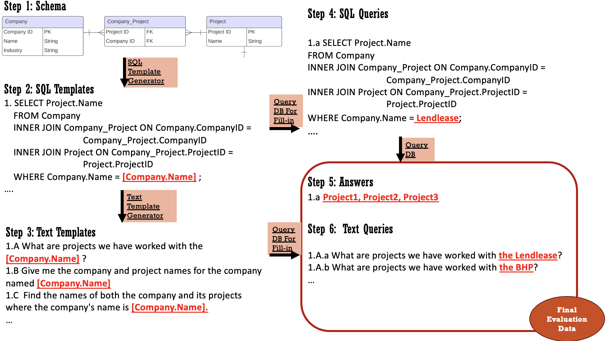

# GRAMMAR: GRounded and Modular Methodology for Assessment of Closed-Domain Retrieval-Augmented Language Models
GRAMMAR is structured around two key components:
1) Grounded Data Generation Method: 
Grounded Data Generation Method: This approach generates text queries and corresponding answers from an existing knowledge base (relational database) for targeted evaluations. Using SQL as an intermediate representation, it allows for the controlled creation of various text queries with consistent underlying logic.
2) Modular Evaluation Protocol: This protocol assesses robustness by not only identifying proposed vulnerabilities but also pinpointing which component exhibits robustness issues against these vulnerabilities.

## Demo 1: Aurp
* Step 1: Initiate Grounded Data Generation on Aurp database ([Notebook](benchmarks/aurp/generate_eval_data.ipynb))
* Step 2: Run Benchmark Models ([Notebook](benchmarks/aurp/generate_response.ipynb))
* Step 3: Modular Evaluation ([Notebook](benchmarks/aurp/eval.ipynb))

## Demo 2: Spider 
* Step 1: Initiate Grounded Data Generation on Spider database ([Notebook](benchmarks/aurp/generate_eval_data.ipynb))
* Step 2: Run Benchmark Models (TBC)
* Step 3: Modular Evaluation (TBC)

## Details of GRAMMAR
### 1. Grounded Data Generation 
Following the the steps:



We will demonstrate an example below using the Spider dataset. To run the code, please run the notebook in the benchmark folder.

**Step 1: Connect to a relational database and an LLM**

* `DBTool` , implemented by sqlalchemy,  supports various relational databases, e.g., MySQL, SQLite. Refer to [Features - SQLAlchemy](https://www.sqlalchemy.org/features.html#:~:text=Supported Databases,of which support multiple DBAPIs.) for all the supported database.

```python
from grammar.db_tool import DBTool
connection_string = 'sqlite:///spider-database/database/company_employee/company_employee.sqlite'
db_tool = DBTool(connection_string)
```


* `AnyOpenAILLM` supports the use of OpenAI GPT series language models, e.g., `'gpt-3.5-turbo`, `gpt-4`. Refer to the [Models - OpenAI API](https://platform.openai.com/docs/models/model-endpoint-compatibility) for the supported model.

```python
from grammar.llm import AnyOpenAILLM
gpt4_llm = AnyOpenAILLM(model_name = "gpt4")  
```


**Step 2: Generate SQL templates**

```python
## a) Automatically generate SQL query templates
sql_template_generator = SQLTemplateGenerator(connection_string, llm)
sql_template_generator.set_system_msg()
sql_templates = sql_template_generator.generate()
sql_template_generator.save(sql_templates, root_dir, overwrite=True)
```

The output is saved in "eval_data/spider/SQLTemplateGenerator/sql_templates.txt" :

```
SELECT Name FROM company WHERE Sales_in_Billion = '[company.Sales_in_Billion]';
SELECT Industry FROM company WHERE Name = '[company.Name]';
SELECT Headquarters FROM company WHERE Market_Value_in_Billion = '[company.Market_Value_in_Billion]';
SELECT Nationality FROM people WHERE Age = '[people.Age]';
SELECT Graduation_College FROM people WHERE Name = '[people.Name]';
SELECT Year_working FROM employment WHERE Company_ID = '[employment.Company_ID]';
SELECT People_ID FROM employment WHERE Year_working = '[employment.Year_working]';
```

To ensure the reliability of the generated SQL templates, you can manually verify and modify them, add new templates, and then reload them for the following steps.

```python
# b) Manually modify SQL query templates (optional)


# c) Load modified SQL query templatesn (optional)
sql_templates = sql_template_generator.load(root_dir)
```

Below are guidelines for **b) manually modify the SQL templates**:

1. **Selecting Attributes That Are Understandable to Humans**
   The selected and condition columns in the query MUST BE MEANINGFUL and DESCRIPTIVE to ensure the queries are easily understood by non-technical users.

2. **Generating Queries With One Ground-truth Answer**
   In the evaluation of question-answering (QA) models, a unique challenge arises from the existence of multiple valid answers to a single query, which necessitates a nuanced approach to assessing model performance. 
   Consider the question: ""Get the name of the client in the digital industry'". For such a question, a set of correct responses could include any combination of names from a predefined list, such as Apple, Amazon, Meta, Facebook\. This multiplicity of correct answers underscores the complexity of evaluating QA models, as it requires the assessment mechanism to recognize and validate the full spectrum of possible correct answers rather than comparing the model's output against a single 'gold standard' answer. Therefore, queries should be generated to ensure one ground-truth answer. Specifically, the evaluation of certain SQL queries, such as ``SELECT Name FROM Company WHERE Industry = '[Company.Industry]';``, requires a complete and thorough listing of multiple answers that can be dynamically changed. To solve the issue, the solution involves adding a specific criterion to the prompt for generating SQL queries. In contrast, the query ``SELECT Industry FROM Company WHERE Name = '[Company.Name]';`` is preferred as it's likely to yield a singular answer about a company's industry based on a specific company name.


So the output file above can be transformed into:

```
SELECT Industry FROM company WHERE Name = '[company.Name]';
SELECT Headquarters FROM company WHERE Name = '[company.Name]';
SELECT Nationality FROM people WHERE Name = '[people.Name]';
SELECT Graduation_College FROM people WHERE Name = '[people.Name]';
SELECT e.Year_working FROM employment e JOIN company c ON e.Company_ID = c.Company_ID JOIN people p ON e.People_ID = p.People_ID WHERE c.Name = '[company.Name]' AND p.Name = '[people.Name]';
```


**Step 3: Generate text templates**

```python
linguistic_attr = "short"
text_template_generator = TextTemplateGenerator(llm=llm)
text_template_generator.set_system_msg(linguistic_attr= linguistic_attr)
text_template_generator = text_template_generator.from_file(linguistic_attr= linguistic_attr, root_dir=root_dir) # Load existing generations to avoid re-generation
sql_to_text_templates = text_template_generator.generate_batch(sql_templates, verbose=True)
text_template_generator.save(sql_to_text_templates, root_dir, overwrite=True)
```


**Step 4: Generate Evaluation Data (Text Queries and Answers)**

```python
qa_generator = QADataGenerator(db_tool)
all_answers_to_text_queries = qa_generator.generate(sql_to_text_templates)
qa_generator.print_query_stats(all_answers_to_text_queries)
file_name = f"{linguistic_attr}.json"
qa_generator.save(all_answers_to_text_queries, root_dir, file_name)
```


**Step 5: Re-Run Step 3 and Step 4 to Generate Constrastive Data**

For example, one hypothesis can be that  models are vulnerable to long queries. The only change is to set `linguistic_attr=long` at Step 2.


### 2. Modular Evaluation Protocol
